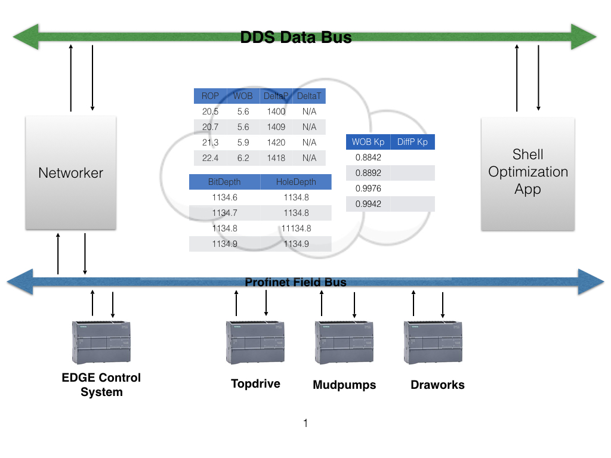

\mainpage

#EDGE Process Automation Interface

##Overview

The purpose of this document is to provide an ICD (Interface Control Document) for the Ensign EDGE Automation Interface.  The purpose is to communicate all possible inputs to and all potential outputs from the EDGE system for some potential or actual user of the system.  This document describe the following

* The inputs and outputs of the EDGE Process Automation Interface.
* The interface between two systems or subsystems, e.g. "The Edge control system and, but not limited to, the Shell Auto Tuner"
* The complete interface protocol from the lowest physical elements (e.g., Profinet) to the highest logical levels (e.g., EDGE Process Automation Interface).

This ICD will only describe the interface itself, and not the characteristics of the systems which use it to connect. The function and logic of those systems will be described in their own design documents if required. In this way, independent teams can develop the connecting systems which use the interface specified, without regard to how other systems will react to data and signals which are sent over the interface. This ICD will include information about the type, description, and unit of what is measured by the data, but not any ultimate meaning of the data in its intended use by any user.

##Communication

All communication between the EDGE control system and the Shell Auto Tuner will be expressed as normalized topics which use the DDS (Data Distribution Service) publish/subscribe protocol to provide asynchronous communication.  Certain QoS (quality of service) attributes will be available for to the Shell Auto Tuner to determine the quality of the data it is receiving as well as the state of the data it has requested.  These QoS attributes will allow the Shell Auto Tuner to specify specific events (or timers) for notification of data arrival, deadlines, etc.  A communication pattern known as Objective/State (similar to observer pattern) will be used to distribute objectives to the Rig Control System.  

For safety reasons all process level requests to the system are merely suggestions and the EDGE control system will decide if the request is within the specified safety margins.

###Objective/State

The objective/state pattern utilizes two actors.  One actor represents a requestor and the other represents an effector.  There can be a many-to-many relationship between requestors and effectors. This allows the communication between the Rig Control System (the control layer) and the Edge Process Automation Interface (the process layer) to be data-centric.  It also allows the process layer to remain agnostic about the underlying control system.  Focusing on the functional aspects of the system rather then detailed knowledge of how the Rig Control system functions.  Allows components to express intent and communicate about actions

* Allows additional observing components to leverage request, objective data
* Avoids tight application-to-application coupling of RPC-like (anti-)patterns
 

####Objective State Pattern: Use Cases

* How can one party request that another party do something?
* How can a producer know that observers(s) have acted on its data?
* How can a producer observe the “result” of a remote action?

####Requestor

A requestor is an actor which "requests" the resources of another actor.  A requestor makes a "request" by stating its intentions or publishing the intended state to the system.  The request is completely asynchronous which means that the requestor must observe the current state of the system to see if the request is being handled by the system.  Requestors perform the following responsibilities:

* publish requests to the system
* observe current state of the system

####Effector

The effector is an actor which can satisfy the state of a requestor.  Effectors perform the following responsibilities:

* observe intended state changes
* publish the current state of the effector

####QoS

The following QoS policies will be supported in the first release of the interface.  These QoS policies are configurable at runtime.  The policies should not be baked into the code but set by the consumer of the data.

#####Reliability Policies

Reliability controls the guarantee of packet delivery as well as historical persistence.

For some use cases, such as the periodic update of sensor values to a GUI displaying the value to a person, "best effort" delivery is often good enough. It is certainly the fastest, most efficient, and least resource-intensive (CPU and network bandwidth) method of getting the newest/latest value for a topic from DataWriters to DataReaders. But there is no guarantee that the data sent will be received. It may be lost due to a variety of factors, including data loss by the physical transport such as wireless RF or even Ethernet. Packets received out of order are dropped and a SAMPLE_LOST Status is generated.

However, there are data streams (topics) in which you want an absolute guarantee that all data sent by a DataWriter is received reliably by DataReaders. This means that Connext DDS must check whether or not data was received, and repair any data that was lost by resending a copy of the data as many times as it takes for the DataReader to receive the data.

* *Reliability* - Specifies whether or not DDS will deliver data reliably.
* *History* - Specifies how much data must be stored by the middleware.

#####Durability Policies

Because the publish-subscribe paradigm is connectionless, applications can create publications and subscriptions in any way they choose. As soon as a matching pair of DataWriters and DataReaders exist, then data published by the DataWriter will be delivered to the DataReader. However, a DataWriter may publish data before a DataReader has been created. For example, before you subscribe to a magazine, there have been past issues that were published.

This QosPolicy can be used to help ensure that DataReaders get all data that was sent by DataWriters, regardless of when it was sent. This QosPolicy can increase system tolerance to failure conditions.  The following options are available for durability:

* *Volatile Durability* - Do not save or deliver old data samples.
* *Transient Local* - Save and deliver old data samples if the publishing application still exists.
* *Transient Durability* - Save and deliver old data samples using a memory-based service.
* *Persistence Durability* - Save and deliver old data samples using disk-based service.

#####QoS Events

* *OnDataAvailable* - Mechanism to notify a subscriber when new data is available for reading.             
* *OnLivelinessLost* - Mechanism to notify a subscriber that a producer of data is no longer valid. Does not tell us why the DataWrtier is no longer available.
* *OnDeadlineMissed* - Mechanism to notify a subscriber that the expected deadline for a new data sample has expired.
* *OnDataDisposed* - Mechanism to notify a subscriber that the DataWriter has disposed of the topic instance.  This instnace will never be seen again
* *OnPublicationMatched* - Mechanism to notify a subscriber that a new publisher is available.

#####OnDataAvailable

The *OnDataAvailable* QoS policy requests a specific mechanism to be notified when new samples of data arrive.  The subscribing application may want to act immediately on new data samples.  This mechanism allows the subscribing application to base arrival of data on events rather than traditional polling mechanisms.  The SAMPLE_INFO structure will inform the subscribing application about the validity of the data sample.

#####OnLivelinessLost

The *OnLivelinessLost* QoS policy requests a specific mechanism for the publishing application to maintain the liveliness of all subscribing entities. The subscribing application may want to know that the publishing application is explicitly asserting the liveliness of the matching DataWriter rather than inferring its liveliness.  The subscribers lease_duration specifies the maximum period at which matching Publishers must have their liveliness asserted. In addition, in the subscribing application DDS uses an internal thread that wakes up at the period set by the subscribers lease_duration to see if the publishers lease_duration has been violated.

#####OnDeadlineMissed

This *OnDeadlineMissed* QoS policy states the maximum period in which the application expects to receive new values for the Topic. The application may receive data faster than the rate set by this QoS policy.  You can use this QoS policy during system integration to ensure that applications have been coded to meet design specifications. You can also use it during run time to detect when systems are performing outside of design specifications. Receiving applications can take appropriate actions to prevent total system failure when data is not received in time. For topics on which data is not expected to be periodic, the deadline period should be set to an infinite value.

#####OnPublicationMatched

This *OnPublicationMatched* QoS policy informs the subscriber that a publisher is now available in the system.  This QoS policy can be used to inform the application the state of the system.  If there is a publisher available 

##Safe Operation

To ensure safe operation of the control system the platform solution must ensure that there is only every a single owner of the process and/or tool.  The platform must also ensure that any set-points presented to the system which fall outside the normal operating range will be disregarded by the system.  

###Single tool owner

To ensure safe operations of the system there can only ever be a single owner of the rig control system.  The driller MUST be presented a mechanism to easily switch between application and manual input.  

###Validation of set-points

Validation of set-points will take place at multiple levels.  First it is the responsibility of the optimization application to only send values within the constraints specified in the *State* interface.  Second the networker will be responsible for validating any input it receives from the application.  If a value is determined to be outside the safe operating limits then the networker will disregard the suggested set-points and not send them to the control system.  Finally it will be the responsibility of the control system to vet all set points it receives to ensure the values are within safe tool limits.

##Interfaces

This section details the interfaces that are available in the EDGE Process Automation interface.  Interfaces are broken into two categories *Request* and *State*.  *Requests* are used to infer state to the environment while *State* interfaces are used to observe a stateful view of the environment. 

*Request* and *State*  always have the following framework data members *id* and *timestamp*  The *id* is the unique id of the requester.  The *id* is the primary key of the topic and is used to differentiate this topic from other topics of the same type.  The *timestamp* is the time the data sample was published.  At the time of delivery the framework will take the timestamp from the sample metadata that was produced by the publisher and store it in the sample.  This is done to allow the consumer of the data the opportunity to make queries on the samples based on a specified time series.

###Type

###Units

All units are specified in derived SI.  It is the responsibility of all producers and consumers to do proper unit conversions to/from SI before publishing or consuming the data.  Specifying a standard base unit system allows the consumer of the data to easily and dynamically determine a unit without affecting the interface.

###Interface Structure

All interfaces follow a very specific structure.  All interfaces have an ID which is the primary key and a timestamp which represents the time the data was published by the source.  

