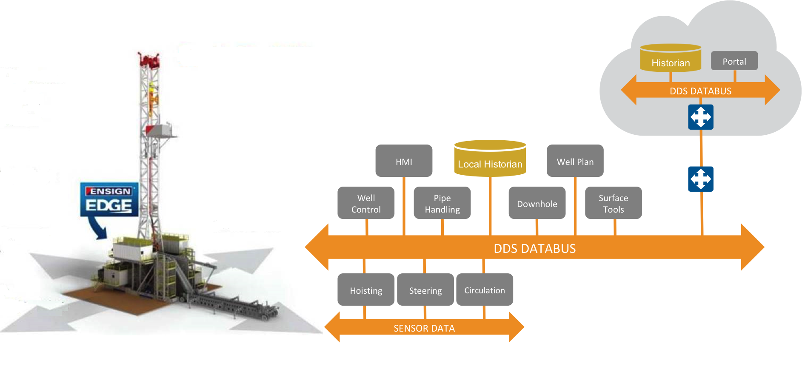
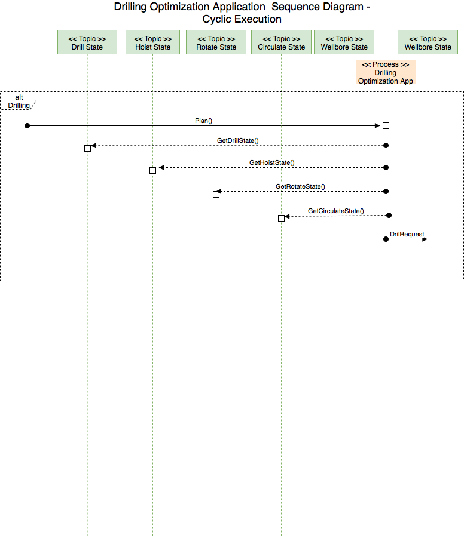

\mainpage

# EDGE Automation System

## Table of contents
1. [Overview](#overview)
2. [A Federated Approach](#federated_approach)
   1. [Commuication Paradigm](#communication_paradigm)
      1. [Objective State] (#objective_state)
	 1. [Requestor] (#requestor)
	 2. [Effector] (#effector)
      2. [Safe Operations] (#safe_operations)
3. [Interfaces] (#interfaces) 
	1. [Anatomy of an Interface] (#anatomy_of_interface)
		1. [Units] (#units)
	2. [Process Interfaces] (#process_interfaces)
	    1. [AutoReam Request] (#autoream_request)
	    2. [AutoReam State] (#autoream_state)
	    5. [Circulate State] (#circulate_state)
	    6. [Hoist State] (#hoist_state)
	    7. [Rotate Request] (#rotate_request)
	    8. [Rotate State] (#rotat_state)
4. [Appendix] (#appendix)
  1. [Key words to Indicate Requirement Levels] (#key_words_requirement_levels)

# Overview 
The goal of this document is to provide a detailed overview of the Ensign EDGE Automation System API.  There should be enough information to enable disparete groups to develop applications for the EDGE Automation System.  This document will describe in detail all inputs, outputs and behavior of each available interfaces.  Each interface description provides the following detail:

* all date members in each interface
* type of each data member 
* description of each data member
* unit of measure, where applicable, each data member is expressed in.
* Qualitiy of Service (QoS) for each interfaces
  * termporal characteristics
  * spatial characteristics

## A Federated Approach - Data Centric Architectures

Federated systems are systems composed on distinct nonoverlapping roles.  This system is based around Data Centric principals which employs the following design principals.

* Weak Coupling
* Strong Cohesion
* Isolation of Concerns
* Locus of Control
* Domain of Authority
* Domain of Responsibility

Object oriented programming (OOP) changed the way we write and organize code, so that we can write larger, more complex and more maintainable code. While not perfect, it has proven to be an extremely versatile and intuitive way to describe application behavior.

Data Centric is opposite of Object Oriented.  In Object Oriented you hide the data and expose the methods.  In a data centric architecure you hide the methods and expose the data.  

## Communication Paradigm

All communication between the EDGE control system and the optimization applications will be expressed as normalized topics which use the DDS (Data Distribution Service) data-centric protocol to provide asynchronous communication.  Certain QoS (quality of service) attributes will be available for to the optimization applications to determine the quality of the data it is receiving as well as the state of the data it has requested.  These QoS attributes will allow the applications to specify specific events (or timers) for notification of data arrival, deadlines, etc.  A communication pattern known as Objective/State (similar to observer pattern) will be used to distribute objectives to the Rig Control System.  

For safety reasons all process level requests to the system are merely suggestions and the EDGE control system will decide if the request is within the specified safety margins.

### Objective/State

The objective/state pattern utilizes two actors.  One actor represents a requestor and the other represents an effector.  There can be a many-to-many relationship between requestors and effectors. This allows the communication between the Rig Control System (the control layer) and the Edge Process Automation Interface (the process layer) to be data-centric.  It also allows the process layer to remain agnostic about the underlying control system.  Focusing on the functional aspects of the system rather then detailed knowledge of how the Rig Control system functions.  Allows components to express intent and communicate about actions
* Allows additional observing components to leverage request, objective data
* Avoids tight application-to-application coupling of RPC-like (anti-)patterns
 

#### Objective State Pattern: Use Cases
* How can one party request that another party do something?
* How can a producer know that observers(s) have acted on its data?
* How can a producer observe the “result” of a remote action?

#### Requestor

A requestor is an actor which "requests" the resources of another actor.  A requestor makes a "request" by stating its intentions or publishing the intended state to the system.  The request is completely asynchronous which means that the requestor must observe the current state of the system to see if the request is being handled by the system.  Requestors perform the following responsibilities:

* publish requests to the system
* observe current state of the system

#### Effector

The effector is an actor which can satisfy the state of a requestor.  Effectors perform the following responsibilities:

* observe intended state changes
* publish the current state of the effector

## Safe Operations 

To ensure safe operation of the control system the platform solution **MUST** ensure that there is only every a single owner of the process and/or tool.  The platform must also ensure that any set-points presented to the system which fall outside the normal operating range will be disregarded by the system.  

### Single tool owner

To ensure safe operations of the system there can only ever be a single owner of the rig control system.  The driller **MUST** be presented a mechanism to easily switch between application and manual input.  

### Validation of set-points

Validation of set-points will take place at multiple levels.  First it is the responsibility of the optimization application to only send values within the constraints specified in the *State* interface.  Second the networker will be responsible for validating any input it receives from the application.  If a value is determined to be outside the safe operating limits then the networker will disregard the suggested set-points and not send them to the control system.  Finally it will be the responsibility of the control system to vet all set points it receives to ensure the values are within safe tool limits.

## Process Interfaces

### AutoReam Request 

AutoReam Request is an epermeral topic which can only be published when the current system objective is "AutoReaming". This topic is used to request changes in the operational AutoReaming parameters. This is an aperiodic topic and should only be published when a value changes.    

| Variable                  | Description                               | Type      | SI Unit |                                                                 
| :-----------------------  | :-----------------------------------------| :-------- | :-------|                                                                 
| ropLimit                  | Maximum configured rate of penetration.   | double    | m/sec   |                                                                 
| wobLimit                  | Maximum configured weight on bit.         | double    | N       |                                                                 
| differentialPressureLimit | Maximum configured differentail pressure. | double    | Pa      |                                                
| torqueLimit               | Maximum configured surface torque.        | double    | Nm      |                                                             
| ropMode                   | Rate of Penetration mode enabled.         | boolean   | *N/A*   |                                                             
| wobMode                   | Weight on bit mode enabled.               | boolean   | *N/A*   |                                                             
| differentialPressureMode  | Differential Pressure mode enabled.       | boolean   | *N/A*   |                                                             
| torqueMode                | Torque mode enabled.                      | boolean   | *N/A*   |                                                              

#### AutoReam Request QoS

The following QoS events are available for any observer who subscribes to the  the AutoReam Requst Topic.  

* OnDataAvailable  
* OnLivelinessLost 
* OnDataDisposed

The following QoS policies are available for any observer of the AutoReam Requst Topic.  

| Qos Policy            | Value                                                                         |                                                                 
|:--------------------  | :-----------------------------------------------------------------------------------|                                                                 
| Reliability           | Reliable |
| Durability            | Transient Local Durability                                                                 |
| History               | Last sample                                                       |

### AutoReam State

The AutoReam State topic will only be published when the current system objective is "AutoReaming". The AutoReam State is an aperiodic interface which is publishes on change.  This topic is available by any actor of the system interested in observing the current state of the AutoReaming process.  

| Variable           | Description     | Data Type     | Unit    |
| :----------------- | :--------------------------------------------------- | :------------ | :------- |
| quillTipPos   |  This is block position in meters               | double        | m |
| holeDepth        |  This is constant, so you can see that there is no autoream, only cleaning | double | m |
| dpPressure |  This is DP in kiloPascals  | double | Pa |
| weightOnBit|  This is WOB in decaNewtons | double | N  |
| standpipePressUnfiltered |  This is standpipe pressure in kiloPascals |double | Pa |
| blockSpeed  |  This is block speed in meters/second | double | m/sec |
| tDQuillSpeed | This is TD rotary speed in RPM     | double | rad/sec |

                                         

#### AutoReam State QoS

The following QoS events are available for any observer of the AutoReam State Topic.  

* OnDataAvailable  
* OnLivelinessLost   
* OnDataDisposed

The following QoS policies are available for any observer of the AutoReam State Topic.  

| Policy                 | Definition                                                                         |                                                                 
| :-------------------  | :-----------------------------------------------------------------------------------|                                                                 
| Reliability           | Reliable |
| Durability            | Transient Local Durability                                                                 |
| History               | Last sample                                                       |

### Circulation State

The circulation state interface is a persistent interface which is guaranteed to be available by the system at all times regardless of the current system objective.  The state of the interface will be published only when any of the interface contents change.  This interface is available for consumption by any actor of the system interested in observing the current process state of the circulation system.  The interface is guaranteed to publish only at a frequency equal to or less than that of the underlying control system.

| Variable                  | Description                               | Type      | SI Unit |                                                                 
| :-----------------------  | :-----------------------------------------| :-------- | :-------|
| status           | <ul><li>Good</li><li>Fault</li></ul>      | enumeration  |  N/A    |                                                                 
| actualFlowRate            | Actual measured volumetric flow in.       | double    | m3/sec |                                              | 
| actualStandpipePressure   | Actual measured standpipe pressure.       | double    | Pa   |  
| minFlowRate               | Minimum volumetric flow in.                | double    | m3/sec |
| maxFlowRate               | Maximum volumetric flow in.            | double    | m3/sec | 
| minStandpipePressure      | Minimum allowable standpipe pressure.     | double    | Pa                |                                                      
| maxStandpipePressure      | Maximum allowable standpipe pressure.     | double    | Pa                |                                                                 
| targetFlowRate            | Target volumetric flow in.                | double    | m3/sec |                                                                 

#### Circulation State QoS

The following QoS events are available for any observer of the Circulate State Topic.  

* OnDataAvailable  
* OnLivelinessLost   
* OnDataDisposed

The following QoS policies are available for any observer of the Circualte State Topic.  

| Policy                 | Definition                                                                         |                                                                 
| :-------------------  | :-----------------------------------------------------------------------------------|                                                                 
| Reliability           | Reliable |
| Durability            | Transient Local Durability                                                                 |
| History               | Last sample                                                       | 

### Hoist State

The hoist state interface is a persistent interface which is guaranteed to be available by the system at all times regardless of the current system objective.  The state of the interface will be published only when any of the interface contents change.  This interface is available for consumption by any actor of the system interested in observing the current process state of the hoisting system.  The interface is guaranteed to publish only at a frequency equal to or less than that of the underlying control system.

*NOTE* : Please note the following semantics 
**velocity** is always in reference to block speed
 **position** is always in reference to elevator (*internal calculation of the control system may use both the elevator and the block to calculate position*).

| Variable                  | Description                               | Type      | SI Unit |                                                                 
| :-----------------------  | :-----------------------------------------| :-------- | :-----|                                                                 
| hoistStatus               | <ul><li>Good</li><li>Fault</li></ul>      | enumeration  |  N/A    |   
| actualHookload            | Actual block velocity(+ Hoisting, - Lowering) | double    | m/sec |                                                                 
| actualVelocity            | Actual block velocity(+ Hoisting, - Lowering) | double    | m/sec |                                                                 
| actualPosition            | Actual measured quill tip position        | double    |   m   |                                                                 
| maxHookload               | Maximum hoist velocity of the block.      | double    | m/sec |                                                                 
| maxHoistVelocity          | Maximum hoist velocity of the block.      | double    | m/sec |                                                                 
| maxLowerVelocity          | Maximum lower velocity of the block.      | double    | m/sec |                                                                 
| maxHoistPosition          | Minimum distance the elevator will hoist. | double    |   m   |                                                                 
| maxLowerPosition          | Maximum distance the elevator will lower. | double    |   m   |  
| targetVelocity            | Target hoisting velocity,  (+ Hoisting, - Lowering)   | double    | m/sec |                                                                 
| targetPosition            | Target measured quill  position           | double    |   m   |                                                                 

#### Hoist State QoS

The following QoS events are available for any observer of the Hoist State Topic.  

* OnDataAvailable  
* OnLivelinessLost   
* OnDataDisposed

The following QoS policies are available for any observer of the Hoist State Topic.  

| Event                 | Description                                                                         |                                                                 
| :-------------------  | :-----------------------------------------------------------------------------------|                                                                 
| Reliability           | Reliable |
| Durability            | Transient Local Durability                                                                 |
| History               | Last sample                                                       |

### Rotate Request

The rotate request interface is an ephemeral interface which issued by a requestor to modify the current state of the system.  The state of the interface will be published only when the publishing algorithm requests.    

| Variable                  | Description                               | Type      | SI Unit |                                                                 
| :-----------------------  | :-----------------------------------------| :-------- | :-------|                                                                 
| targetRate           | Requested target in rad/sec.            | double    | rad/sec   |                                                                 
                                                           

#### Rotate Request QoS

The following QoS events are available for any observer of the Rotate Request Topic.  

* OnDataAvailable  
* OnLivelinessLost   
* OnDataDisposed

The following QoS policies are available for any observer of the Rotate Request Topic.  

| Event                 | Description                                                                         |                                                                 
| :-------------------  | :-----------------------------------------------------------------------------------|                                                                 
| Reliability           | Reliable |
| Durability            | Transient Local Durability                                                                 |
| History               | Last sample                                                       |

### Rotate State

The rotation state interface is a persistent interface which is guaranteed to be available by the system at all times regardless of the current system objective.  The state of the interface will be published only when any of the interface contents change.  This interface is available for consumption by any actor of the system interested in observing the current process state of the rotation system. The interface is guaranteed to publish only at a frequency equal to or less than that of the underlying control system.

| Variable                  | Description                               | Type      | SI Unit |                                                                 
| :-----------------------  | :-----------------------------------------| :-------- | :-------|                                                                 
| actualRate                | Current rate in rad/sec.                  | double    | rad/sec |                                                                 
| minRate                   | Minimum rate in rad/sec.                  | double    | rad/sec |                                                                 
| maxRate                   | Maximum rate in rad/sec.                  | double    | rad/sec |                                                                 
| targetRate                | Current target in rad/sec.                | double    | rad/sec |                                                                 
| rotateStatus              | <ul><li>Good</li><li>Fault</li></ul>      | enumeration |  N/A    |

#### Rotate State QoS

The following QoS events are available for any observer of the Rotate State Topic.  

* OnDataAvailable  
* OnLivelinessLost   
* OnDataDisposed

The following QoS policies are available for any observer of the Rotate State Topic.  

| Event                 | Description                                                                         |                                                                 
| :-------------------  | :-----------------------------------------------------------------------------------|                                                                 
| Reliability           | Reliable |
| Durability            | Transient Local Durability                                                                 |
| History               | Last sample                                                       |

### Wellbore

The wellbore state interface is a persistent interface which is guaranteed to be available by the system at all times regardless of the current system objective.  The state of the interface will be published only when any of the interface contents change.  This interface is available for consumption by any actor of the system interested in observing the current state of the bit in relation to the bottom of the wellbore.  The interface is guaranteed to publish only at a frequency equal to or less than that of the underlying control system. 

| Variable                  | Description                              | Type      | SI Unit |                                                                 
| :-----------------------  | :----------------------------------------| :-------- | :-------|                                                                 
| holeDepth                 | Current measured hole depth              | double    |   m     |                                                          
| bitDepth                  | Current measured bit depth               | double    |   m     |                                                                 
                                                              

#### Wellbore State QoS

The following QoS events are available for any observer of the Wellbore State Topic.  

* OnDataAvailable  
* OnLivelinessLost   
* OnDataDisposed

The following QoS policies are available for any observer of the Wellbore State Topic.  

| Event                 | Description                                                                         |                                                                 
| :-------------------  | :-----------------------------------------------------------------------------------|                                                                 
| Reliability           | Reliable |
| Durability            | Transient Local Durability                                                                 |
| History               | Last sample                                                       |

## Engineering Interfaces

### Drilling Calibration Request 

The drilling calibration request interface is an ephemeral interface which issued by a requestor to modify the current state of the system.  The state of the interface will be published only when the publishing applications requests.    

| Variable                  | Description                               | Type      | SI Unit |                                                                 
| :-----------------------  | :-----------------------------------------| :-------- | :-------|                                                                 
| wobProportional           | Actual measured weight on bit.            | double    | *N/A*   |                                                                 
| wobIntegral               | Actual measured weight on bit.            | double    | sec      |                                                                 
| differentialPressureProportional| Actual measured differential pressure.    | double    | *N/A*      |                                                                 
| differentialPressureIntegral| Actual measured differential pressure.  | double    | sec      |                                                                 
| torqueProportional        | Actual measured surface torque.           | double    | *N/A*   |                                                                 
| torqueIntegral            | Actual measured surface torque.           | double    | sec      |                                                                 

#### Drilling Calibration Request QoS 
The following QoS events are available for any observer of the Drilling State Calibration Topic.  

| Qos Policy            | Description                                                                         |                                                                 
|:--------------------  | :-----------------------------------------------------------------------------------|                                                                 
| OnLivelinessLost      | Event to notify subscriber that producer of data is no longer valid.                |
| Reliability           | Reliable |
| Durability            | Transient Local Durability                                                                 |
| History               | Last sample                                                       |

### Drilling State Calibration 

The drilling state calibration interface is a persistent interface which is guaranteed to be available by the system at all times regardless of the current system objective.  The state of the interface will be published only when any of the interface contents change.  This interface is available for consumption by any actor of the system interested in observing the current state calibration parameters of the EDGE autodriller.  The interface is guaranteed to publish only at a frequency equal to or less than that of the underlying control system.  

| Variable                  | Description                                  | Type      | SI Unit |                                                                 
| :-----------------------  | :--------------------------------------------| :-------- | :-------|                                                                 
| wobProportional           | Weight on bit proportional.               | double    | *N/A*   |                                                                 
| minWobProportional        | Minimum weight on bit proportional.               | double    | *N/A*   |                                                                 
| maxWobProportional       | Maximum weight on bit proportional.               | double    | *N/A*   |                                                                 
| wobIntegral               | Weight on bit integral.               | double    | sec      |                                                                 
| minWobIntegral            | Minimum weight on bit integral.               | double    | sec     |                                                                 
| maxWobIntegral;            | Maximum weight on bit integral.               | double    | sec     |                                                                 
| differentialPressureProportional| Differential pressure proportional. | double    | *N/A*   |                                                                 
| minDifferentialPressureProportional| Minimum differential pressure proportional. | double    | *N/A*   |                                                                 
| maxDifferentialPressureProportional| Maximum differential pressure proportional. | double    | *N/A*   |                                                                 
| differentialPressureIntegral| Differential pressure integral.     | double    | sec     |                                                                 
| minDifferentialPressureIntegral| Minimum differential pressure integral.     | double    | sec     |                                                                 
| maxDifferentialPressureIntegral| Maximum differential pressure integral.     | double    | sec     |                                                                 
| torqueProportional        | Torque proportional.              | double    | *N/A*   |                                                                 
| minTorqueProportional        | Minimum torque proportional.              | double    | *N/A*   |                                                                 
| maxTorqueProportional        | Maximim torque proportional.              | double    | *N/A*   |                                                                 
| torqueIntegral            | Torque integral.              | double    | sec      |                                                                 
| minTorqueIntegral            | Minimum torque integral.              | double    | sec     |                                                                 
| maxTorqueIntegral            | Maximum torque integral.              | double    | sec     |                                                                 

#### Drilling State Calibration QoS 

The following QoS events are available for any observer of the Drilling State Calibration Topic.  

| Event                 | Description                                                                         |                                                                 
| :-------------------- | :-----------------------------------------------------------------------------------|                                                                 
| OnDataAvailable       | Event to notify subscriber new data is available for reading.                       |    
| OnLivelinessLost      | Event to notify subscriber that producer of data is no longer valid.                |
| OnDeadlineMissed      | Event to notify subscriber that expected deadline for new data sample has passed.   | 
| Reliability           | Reliable |
| Durability            | Transient Local Durability                                                                 |
| History               | Last sample                                                       |

## Future Interfaces

The falling interfaces are to be provided in the future, but some aspect of the interface may be available in the current release.

### Formation Interface

The formation interface is a persistent interface which is guaranteed to be available by the system at all times regardless of the current system objective.  The state of the interface will be published only when any of the interface contents change.  This interface is available for consumption by any actor of the system interested in observing the historical state of the formations.  The interface is guaranteed to publish only at a frequency equal to or less than that of the underlying control system.

| Variable                  | Description                                    | Type      | SI Unit |                                                                 
| :-----------------------  | :----------------------------------------------| :-------- | :-------|                                                                 
| name                      | Name of formation                              | string    | *N/A*   |                                                                 
| topOfFormation            | Top of formation expressed as measured depth   | double    |    m    |                                                                 
| bottomOfFormation         | Bottom of formation expressed as measured depth| double    |    m    |  
| porosity                  | Measure of its ability to hold a fluid         | double    | *N/A*   |
| permeability              | Measure of the resistance to the flow of a fluid through a rock | double | m2 |
| strength                  | 

#### Formation QoS

The following QoS events are available for any observer of the Drilling State Topic.  

| Event                 | Description                                                                         |                                                                 
| :-------------------  | :-----------------------------------------------------------------------------------|                                                                 
| OnDataAvailable       | Event to notify subscriber new data is available for reading.                       |    
| OnLivelinessLost      | Event to notify subscriber that producer of data is no longer valid.                |
| Reliability           | Reliable |
| Durability            | Transient Local Durability                                                                 |
| History               | Last sample                                                       |

#### Pipe Tally Interface

The pipe tally interface is a persistent interface which is guaranteed to be available by the system at all times regardless of the current system objective.  The state of the interface will be published only when any of the interface contents change.  This interface is available for consumption by any actor of the system interested in observing the historical contents of the pipe tally.  The interface is guaranteed to publish only at a frequency equal to or less than that of the underlying control system.

| Variable                  | Description                               | Type      | SI Unit |                                                                 
| :-----------------------  | :-----------------------------------------| :-------- | :-------|                                                                 
| serialNumber              | Serial number of tool joint.              | string    | *N/A*   |                                                                 
| jointNumber               | Joint number in reference to string.      | integer   | *N/A*   |                                                                 
| standNumber               | Stand number in reference to string.      | integer   | *N/A*   |                                                                 
| weight                    | Stand weight.                             | double    | N       |                                                                 
| outerDiameter             | Outer diameter of tool joint.             | double    | m      |                   
| innerDiameter             | Inner diameter of tool joint.             | double    | m      |                   
| kellyDown                 | Depth at which Kelly Down will occur.     | double    | m       |                   
| length                    | Strapped length of stand measured by the driller.   | double   |   m    |                   
| pipeLength                | Sum of all active drill pipe excluding the BHA.     | double   |   m    |                   
| stringLength              | Sum of all active elements in the drill string, including the BHA.  | double   |   m    |                   
| description               | Driller notes.                            | string   |   *N/A* |                   
| pipeType                  | <ul><li>Heavy Weight drill pipe</li><li>Drill Collars</li><li>Standard Drill Pipe</li></ul>   | enumeration   |   N/A  |                   

#### Pipe Tally QoS

| Event                 | Description                                                                         |                                                                 
| :-------------------  | :-----------------------------------------------------------------------------------|                                                                 
| OnDataAvailable       | Event to notify subscriber new data is available for reading.                       |    
| OnLivelinessLost      | Event to notify subscriber that producer of data is no longer valid.                |
| Reliability           | Reliable |
| Durability            | Transient Local Durability                                                                 |
| History               | Last sample                                                       |

## Sequence Diagrams

This section details the various interactions of the system.

### ROP Optimization Interface - Cyclic Execution Cycle

This diagram depicts four state topics *DrillState*, *WellboreState*, *HoistSTate*, *RotateState*, *CirculateState* and one request topic *DrillRequest*.  The four state topics are updated by the controller when new data samples arrive from the EDGE control system.  The controller will monitor the state of the system and publish the *Objetive* topic based on the state of the system. 

 

# Appendix

## Key words to Indicate Requirement Levels

    This document refers to RFC2119 for the defintion of requiremnt levels.

###Abstract

   In many standards track documents several words are used to signify
   the requirements in the specification.  These words are often
   capitalized.  This document defines these words as they should be
   interpreted in IETF documents.  Authors who follow these guidelines
   should incorporate this phrase near the beginning of their document:

      The key words "MUST", "MUST NOT", "REQUIRED", "SHALL", "SHALL
      NOT", "SHOULD", "SHOULD NOT", "RECOMMENDED",  "MAY", and
      "OPTIONAL" in this document are to be interpreted as described in
      RFC 2119.

   Note that the force of these words is modified by the requirement
   level of the document in which they are used.

1. MUST   This word, or the terms "REQUIRED" or "SHALL", mean that the
   definition is an absolute requirement of the specification.

2. MUST NOT   This phrase, or the phrase "SHALL NOT", mean that the
   definition is an absolute prohibition of the specification.

3. SHOULD   This word, or the adjective "RECOMMENDED", mean that there
   may exist valid reasons in particular circumstances to ignore a
   particular item, but the full implications must be understood and
   carefully weighed before choosing a different course.

4. SHOULD NOT   This phrase, or the phrase "NOT RECOMMENDED" mean that
   there may exist valid reasons in particular circumstances when the
   particular behavior is acceptable or even useful, but the full
   implications should be understood and the case carefully weighed
   before implementing any behavior described with this label.

5. MAY   This word, or the adjective "OPTIONAL", mean that an item is
   truly optional.  One vendor may choose to include the item because a
   particular marketplace requires it or because the vendor feels that
   it enhances the product while another vendor may omit the same item.
   An implementation which does not include a particular option MUST be
   prepared to interoperate with another implementation which does
   include the option, though perhaps with reduced functionality. In the
   same vein an implementation which does include a particular option
   MUST be prepared to interoperate with another implementation which
   does not include the option (except, of course, for the feature the
   option provides.)

6. Guidance in the use of these Imperatives

   Imperatives of the type defined in this memo must be used with care
   and sparingly.  In particular, they MUST only be used where it is
   actually required for interoperation or to limit behavior which has
   potential for causing harm (e.g., limiting retransmisssions)  For
   example, they must not be used to try to impose a particular method
   on implementors where the method is not required for
   interoperability.